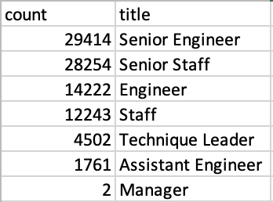

# Pewlett Hackard Analysis

## Overview
The purpose of this analysis is to apply our knowledge of SQL and writing queries to create tables that will allow us to determine information such as the number of employees that are retiring per title as well as to identify the number of employees that are eligible to participate in the mentorship program at Pewlett Hackard.

## Results
* While the *retirement_titles* table is the most detailed in terms of being able to see how employees progress through roles as they undergo promotions, but the duplicate names can get confusing as we might double count employees that are already accounted for once. This leads to the *retirement_titles.csv* being longer than needed at 133,776 rows of employees. See below the repetition of employee names such as Chirstian Koblick, Kyoichi	Maliniak, and Sumant	Peac.

* The *unique_titles* table is a cleaner version of the *retirement_titles* table because it gets rid of the duplicate employee names, meaning we have the true total count of employees retiring at 90,398.

* If we wanted to look at the analysis from a broader point of view and see the total number of employees retiring by position title, we can look at the *retiring_titles* table shown below. The table shows very clearly that out of the 7 different positions from which employees are retiring, the one with most employees leaving is the "Senior Engineer" position with 29,414, which represents about 33% of the employees retiring at Pewlett Hackard.

* The last table created is more detailed than the previous *retiring_titles* table. This table holds the employee information for those employees who are currently employeed with the company and who were born in 1965, meaning they are eligible for the mentorship program. While the mentorship program is a great idea to ensure that newly hired employees learn from experienced employees, the "mentorship_eligibility.csv" shows there are only 1,549 employees currently eligibile for the mentorship program. This is too low of a number when compared to how many employees are leaving the company.

## Summary

### How many roles will need to be filled as the "silver tsunami" begins to make an impact?
There will need to be a total of 90,398 roles filled as the "silver tsunami" starts and employees begin to leave the company.
  
### Are there enough qualified, retirement-ready employees in the departments to mentor the next generation of Pewlett Hackard employees?
According to the *mentorship_eligibility* table, there are only 1,549 employees eligible to be in the mentorship program. This is not enough to mentor the next generation of employees, as the number of employees retiring is over 90 thousand, and there will be far too many positions to fill for the number of mentors available.

A query that can provide more insight into the analysis is the query shown below, which takes the *unique_titles* table and inlcludes the department name that each retiring employee is leaving. This way, the company can see which departments are losing different number of employees, and can then focus on allocating new hires accordingly.

A second, additional query that can also help provide more insight into the analysis is the query shown below, which tells us the department name of the employees that are eligible to be mentors to newly hires. With this query, we can compare the departments of employees eligible to be mentors to the departments that have employees retiring. With this information, the company can better gauge how to distribute the number of mentors by department based on need.

  
